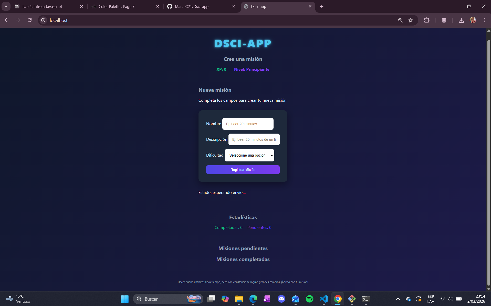
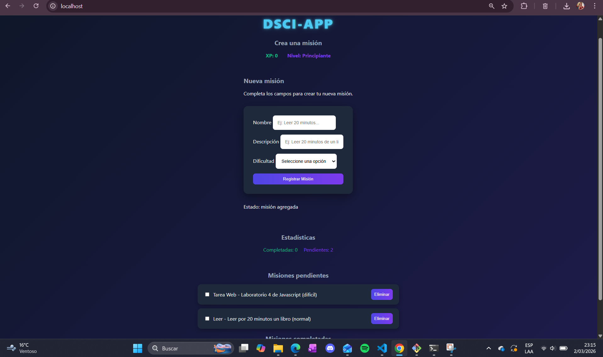
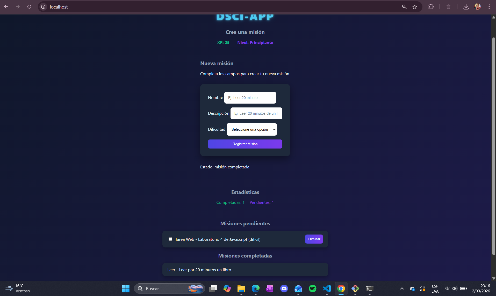

# Disci-App – Laboratorio #4  

## Descripción del Laboratorio

El presente laboratorio consiste en el desarrollo de una aplicación web utilizando **HTML, CSS y JavaScript puro**

El objetivo es aplicar el concepto de **gamification**, incorporando elementos de juego en un contexto no lúdico. En este caso, la aplicación llamada **Disci-App** busca fomentar la disciplina y la creación de buenos hábitos mediante un sistema de misiones y recompensas basadas en experiencia (XP).

La aplicación permite:
- Crear misiones con:
  - Nombre
  - Descripción
  - Dificultad
- Asignar XP según dificultad:
  - Fácil → 10 XP
  - Normal → 25 XP
  - Difícil → 50 XP
- Acumular XP global conforme se completan misiones.
- Clasificar al usuario en tres niveles según su XP:
  - Principiante
  - Intermedio
  - Avanzado
- Marcar misiones como completadas (estado: **SUCCESFUL**).
- Visualizar misiones pendientes y completadas.
- Mostrar estadísticas en tiempo real.

---

## Funcionamiento General

1. El usuario crea una nueva misión mediante un formulario.
2. La misión se agrega a la lista de misiones pendientes.
3. Al marcarla como completada:
   - Se cambia su estado a `SUCCESFUL`.
   - Se mueve a la lista de completadas.
   - Se suma XP según la dificultad.
   - Se actualiza el nivel del usuario automáticamente.
4. El sistema muestra estadísticas actualizadas:
   - XP total
   - Nivel actual
   - Cantidad de misiones pendientes
   - Cantidad de misiones completadas

---

## Tecnologías Utilizadas

- HTML
- CSS
- JavaScript
---

## Estructura del Proyecto
disci-app/
│
├── src/
│ ├── index.html
│ ├── style.css
│ └── app.js
│
├── capturas/
│ ├── captura1.png
│ ├── captura2.png
│ └── captura3.png
│
├── README.md
└── .gitignore

---

## Guía de Instalación y Ejecución

### Opción 1: Abrir directamente

1. Clonar el repositorio:

```bash
git clone <URL_DEL_REPOSITORIO>
```
2. Entrar a la carpeta del proyecto:

```bash
cd disci-app
```

3. Abrir el archivo index.html ubicado en la carpeta src/ en el navegador

### Opción 2: Usar Live Server (recomendado)

Si utiliza Visual Studio Code:
    -Instalar la extensión Live Server
    -Abrir el proyecto
    -Hacer clic derecho sobre index.html
    -Seleccionar Open with Live Server


## Capturas 
-Pantalla principal


-Creación de misión


-Misión completada y actualización de XP


## Video
https://youtu.be/tJs7_cSE7QM 
